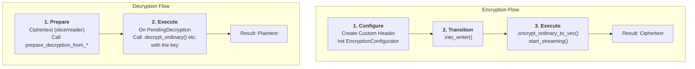

# seal-flow

[](https://crates.io/crates/seal-flow)
[](https://docs.rs/seal-flow)

A high-level cryptographic workflow library built on top of `seal-crypto-wrapper`. It provides a flexible, secure, and high-performance interface for symmetric and hybrid encryption, supporting multiple processing modes including in-memory, streaming, parallel, and asynchronous.

[中文文档 (Chinese README)](./README_CN.md)

## Core Philosophy: The Configure-Execute Pattern

`seal-flow` follows a clear, two-phase model: **Configure-then-Execute**. This ensures that parameters for cryptographic operations are explicitly set before execution, reducing the potential for errors.

-   **Encryption Flow**:
    1.  **Configure (`EncryptionConfigurator`)**: This is the starting point for all encryption operations. You create a custom header that implements the `SealFlowHeader` trait and use it to initialize the `EncryptionConfigurator`.
    2.  **Transition (`into_*`)**: Convert the configurator into a specific encryption flow, such as `into_writer()` for synchronous writing.
    3.  **Execute (`encrypt_*` / `start_*`)**: Call an execution method on the flow, like `encrypt_ordinary()` (in-memory) or `start_streaming()`.

-   **Decryption Flow**:
    1.  **Prepare (`prepare_decryption_from_*`)**: Start with a source containing ciphertext (e.g., a byte slice or a reader) and call a `prepare_decryption_from_*` function. This parses the header and returns a `PendingDecryption` instance without touching the encrypted data.
    2.  **Execute (`decrypt_*`)**: Call the appropriate decryption method on the `PendingDecryption` instance, providing the correct key to complete the process.



## Installation

Add this to your `Cargo.toml`:

```toml
[dependencies]
seal-flow = "0.1.0" # Replace with the latest version
```

## Usage

### Symmetric Encryption

The most common use case: encrypting and decrypting data with a shared key.

```rust,ignore
use seal_flow::prelude::*;
use seal_flow::common::header::{SealFlowHeader, SymmetricParams, SymmetricParamsBuilder};
use seal_flow::sha2::{Digest, Sha256};
use std::borrow::Cow;

// 1. Define a custom header
#[derive(Clone, bincode::Encode, bincode::Decode, serde::Serialize, serde::Deserialize)]
struct MyHeader {
    params: SymmetricParams,
    metadata: String,
}

impl SealFlowHeader for MyHeader {
    fn symmetric_params(&self) -> &SymmetricParams { &self.params }
    fn extra_data(&self) -> Option<&[u8]> { None }
}

// 2. Encrypt
let key = TypedSymmetricKey::generate(SymmetricAlgorithm::build().aes256_gcm())?;
let aad = b"some aad";
let params = SymmetricParamsBuilder::new(SymmetricAlgorithm::build().aes256_gcm(), 4096)
    .aad_hash(aad, Sha256::new())
    .build();
let header = MyHeader { params, metadata: "test".to_string() };

let configurator = EncryptionConfigurator::new(header, Cow::Borrowed(&key), Some(aad.to_vec()));
let ciphertext = configurator.into_writer(Vec::new())?
    .encrypt_ordinary_to_vec(b"my secret data")?;

// 3. Decrypt
let pending = prepare_decryption_from_slice::<MyHeader>(&ciphertext)?;
// You can inspect pending.header().metadata here
let plaintext = pending.decrypt_ordinary(Cow::Borrowed(&key), Some(aad.to_vec()))?;

assert_eq!(plaintext, b"my secret data");
```
The full code for this example can be found in [`examples/simple_symmetric.rs`](./examples/simple_symmetric.rs).

### Hybrid Encryption (KEM-KDF)

Hybrid encryption uses a recipient's public key to encrypt a one-time symmetric key, which is then used to encrypt the data. `seal-flow` supports a KEM-KDF mode, where the symmetric key is derived from the KEM's shared secret.

```rust,ignore
// (Requires "crypto-asymmetric-kem" and "crypto-kdf" features)
use seal_flow::crypto::traits::KemAlgorithmTrait;

// Recipient generates a key pair
let kem = KemAlgorithm::build().kyber1024().into_asymmetric_wrapper();
let key_pair = kem.generate_keypair()?;
let public_key = key_pair.public_key();

// --- Sender ---
// 1. KEM: Encapsulate a shared secret using the public key
let (shared_secret, encapsulated_key) = kem.encapsulate_key(&public_key)?;

// 2. KDF: Derive the symmetric key from the shared secret
let kdf_params = KdfParams { /* ... */ };
let ephemeral_key = shared_secret.derive_key(/* ... */)?;

// 3. DEM: Encrypt the data with the derived key
let header = HybridHeader { /* encapsulated_key, kdf_params, ... */ };
let configurator = EncryptionConfigurator::new(header, Cow::Owned(ephemeral_key), /* ... */);
let ciphertext = configurator.into_writer(Vec::new())?.encrypt_ordinary_to_vec(b"secret")?;

// --- Recipient ---
// 1. Parse the header
let pending = prepare_decryption_from_slice::<HybridHeader>(&ciphertext)?;
let header = pending.header();

// 2. KEM: Decapsulate the shared secret using the private key
let shared_secret = kem.decapsulate_key(&key_pair.private_key(), &header.encapsulated_key)?;

// 3. KDF: Re-derive the key using parameters from the header
let symmetric_key = shared_secret.derive_key_from_params(&header.kdf_params, ...)?;

// 4. DEM: Decrypt the data
let plaintext = pending.decrypt_ordinary(Cow::Owned(symmetric_key), ...)?;
```
The full code for this feature can be found in [`examples/hybrid_encryption.rs`](./examples/hybrid_encryption.rs).

## Execution Modes

`seal-flow` offers several execution modes to handle different workloads. All modes produce data in a unified, compatible format, allowing them to be mixed and matched freely.

| Mode | Encryption API | Decryption API | Use Case |
| :--- | :--- | :--- | :--- |
| **In-Memory** | `encrypt_ordinary` | `decrypt_ordinary` | Simple, fast processing for data that fits in RAM. |
| **Parallel In-Memory** | `encrypt_parallel` | `decrypt_parallel` | High-throughput processing for larger data on multi-core systems. |
| **Streaming** | `start_streaming` | `decrypt_streaming` | For very large files or network I/O with constant memory usage. |
| **Asynchronous Streaming** | `start_asynchronous` | `decrypt_asynchronous` | Non-blocking I/O for async applications (requires `async` feature). |
| **Parallel Streaming** | `start_parallel_streaming` | `decrypt_parallel_streaming` | High-throughput streaming on multi-core systems with low memory usage. |

## Interoperability

A key feature of `seal-flow` is its perfect interoperability between processing modes. Data encrypted using any mode (e.g., `streaming`) can be decrypted by any other mode (e.g., `parallel`), as long as the underlying algorithm and keys are the same.

This is guaranteed by a unified data format and is validated by our comprehensive `interoperability_matrix` integration test. This gives you the flexibility to choose the most efficient mode for encryption and decryption independently, based on your specific needs. For example, a memory-constrained server can stream-encrypt a large file, and a powerful client machine can decrypt it in parallel for maximum performance.

## API Layers

The library primarily exposes two API layers:

-   **Mid-Level API (`seal_flow::prelude` module):** This is the recommended entry point for most users. It provides direct, fine-grained control over the cryptographic workflows (`EncryptionConfigurator`, `PendingDecryption`).
-   **Low-Level API (`seal-crypto-wrapper`):** Exposes the underlying cryptographic primitives directly. This is for experts who need to build custom logic on top of the core algorithms.

## Running Examples

You can run the provided examples using `cargo`. Be sure to enable the required features for each example.

```bash
# Run the simple symmetric encryption example
cargo run --example simple_symmetric

# Run the streaming symmetric encryption example
cargo run --example streaming_symmetric

# Run the hybrid encryption example
cargo run --example hybrid_encryption --features=crypto-asymmetric-kem,crypto-kdf
```

## License

This project is licensed under the Mozilla Public License 2.0. See the [LICENSE](LICENSE) file for details. 