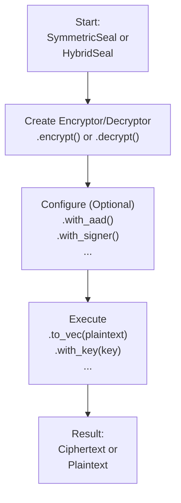

# seal-flow

[](https://crates.io/crates/seal-flow)
[](https://docs.rs/seal-flow)

A stateless, high-level cryptographic workflow library built on top of `seal-crypto`. It provides a unified, fluent, and secure interface for common cryptographic operations like hybrid and symmetric encryption.

[中文文档 (Chinese README)](./README_CN.md)

## Core Philosophy: The Fluent "Seal" API

`seal-flow` is designed to make complex cryptographic workflows feel simple and safe. The core of the library is the high-level `seal` API, which uses a **fluent builder pattern**.

All operations follow a simple, two-phase model: **Configure-then-Execute**.

1.  **Configure**: You start with a `SymmetricSeal` or `HybridSeal` factory, create an encryptor or decryptor, and chain methods like `.with_aad()` or `.with_signer()` to configure the operation.
2.  **Execute**: Once configured, you call a final method like `.to_vec()` (for in-memory data) or `.stream()` (for I/O streams) to perform the cryptographic work.

This design makes your code readable, flexible, and less prone to errors.



## Installation

Add this to your `Cargo.toml`:

```toml
[dependencies]
seal-flow = "0.1.0" # Replace with the latest version
```

## Usage: A Complete Symmetric Workflow

This example demonstrates a full encryption and decryption cycle, including metadata (AAD) and the safe key-lookup pattern.

The full code for this example can be found in [`examples/readme_symmetric_workflow.rs`](./examples/readme_symmetric_workflow.rs).

## Usage: Hybrid Encryption Workflow

Hybrid encryption follows the same fluent pattern. You encrypt with a public key and decrypt with the corresponding private key.

The full code for this example can be found in [`examples/readme_hybrid_workflow.rs`](./examples/readme_hybrid_workflow.rs).

## Key Features & Advanced Usage

### Simplified & Secure Key Management

`seal-flow` promotes security by using strongly-typed key wrappers instead of raw bytes: `SymmetricKey`, `AsymmetricPublicKey`, `AsymmetricPrivateKey`.

For decryption, the `with_key(key_wrapper)` method is recommended. It automatically and safely infers the correct cryptographic algorithm from the ciphertext header, reducing the risk of errors.

For advanced scenarios (e.g., integrating with legacy systems), you can use `with_typed_key::<Algorithm>(concrete_key)` to explicitly specify the algorithm, overriding the header.

### Key Derivation (KDF & PBKDF)

Derive keys from a master key or a password for use cases like key rotation or password-based encryption. This is also useful for creating key hierarchies, for example, using a password to derive a master secret, and then using an Extendable-Output Function (XOF) like SHAKE256 to generate multiple keys of different lengths from it.

The full code for this example can be found in [`examples/readme_advanced_key_derivation.rs`](./examples/readme_advanced_key_derivation.rs).

### Authenticated Associated Data (AAD)

`seal-flow` supports Associated Data (AAD), which is data that is authenticated but not encrypted. This is a critical security feature for preventing replay attacks or context-confusion attacks, where a valid ciphertext is maliciously used in a different context.

The AAD is mixed into the cryptographic calculations, meaning the ciphertext is cryptographically bound to the AAD. If the AAD provided during decryption does not exactly match the AAD from encryption, the decryption will fail.

Common use cases for AAD include:
-   User IDs, session IDs, or request IDs.
-   Version numbers or file paths.
-   Any metadata that defines the context of the encrypted data.

The full code for this example can be found in [`examples/readme_aad.rs`](./examples/readme_aad.rs).

### Digital Signatures

In hybrid encryption, you can also sign the data to prove its origin and integrity.

The full code for this example can be found in [`examples/readme_digital_signatures.rs`](./examples/readme_digital_signatures.rs).

## Interoperability

A key feature of `seal-flow` is its perfect interoperability between processing modes. Data encrypted using any mode (e.g., `streaming`) can be decrypted by any other mode (e.g., `in_memory_parallel`), as long as the underlying algorithm (`Aes256Gcm`, etc.) and keys are the same.

This is guaranteed by a unified data format and is validated by our comprehensive `interoperability_matrix` integration test. This gives you the flexibility to choose the most efficient mode for encryption and decryption independently, based on your specific needs. For example, a memory-constrained server can stream-encrypt a large file, and a powerful client machine can decrypt it in parallel for maximum performance.

## API Layers in Detail

The library exposes three distinct API layers:

-   **High-Level API (`seal` module):** This is the recommended entry point for most users. It features a fluent builder pattern (`SymmetricSeal`, `HybridSeal`) that abstracts away all complexity. You simply chain methods to define the operation, select the mode, and execute.
-   **Mid-Level API (`flows` module):** For advanced users who need more fine-grained control. This layer allows you to directly access and use specific execution flows (e.g., `streaming`, `parallel`, `asynchronous`) without the builder abstraction.
-   **Low-Level API (`crypto` module):** Provides direct, unfiltered access to the underlying `seal-crypto` crate for cryptographic primitives. This is for experts who need to build custom logic on top of the core algorithms.

## Running Examples

You can run the provided examples using `cargo`:

```bash
# Run the high-level symmetric encryption example
cargo run --example high_level_symmetric --features=async

# Run the mid-level hybrid encryption example
cargo run --example mid_level_hybrid --features=async
```

## License

This project is licensed under the Mozilla Public License 2.0. See the [LICENSE](LICENSE) file for details. 