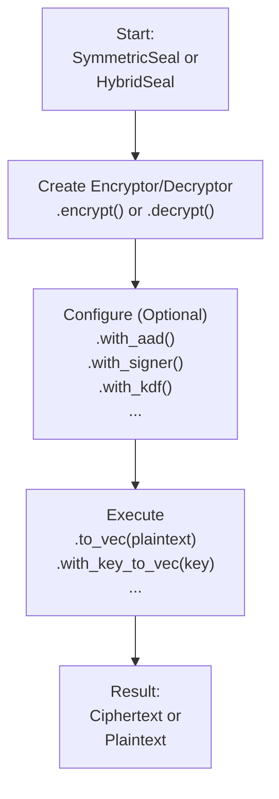

# seal-flow

[](https://crates.io/crates/seal-flow)
[](https://docs.rs/seal-flow)

A stateless, high-level cryptographic workflow library built on top of `seal-crypto`. It provides a unified, fluent, and secure interface for common cryptographic operations like hybrid and symmetric encryption.

[中文文档 (Chinese README)](./README_CN.md)

## Core Philosophy: The Fluent "Seal" API

`seal-flow` is designed to make complex cryptographic workflows feel simple and safe. The core of the library is the high-level `seal` API, which uses a **fluent builder pattern**.

All operations follow a simple, two-phase model: **Configure-then-Execute**.

1.  **Configure**: You start with a `SymmetricSeal` or `HybridSeal` factory, create an encryptor or decryptor, and chain methods like `.with_aad()` or `.with_signer()` to configure the operation.
2.  **Execute**: Once configured, you call a final method like `.to_vec()` (for in-memory data) or `.stream()` (for I/O streams) to perform the cryptographic work.

This design makes your code readable, flexible, and less prone to errors.



## Installation

Add this to your `Cargo.toml`:

```toml
[dependencies]
seal-flow = "0.1.0" # Replace with the latest version
```

## Usage: A Complete Symmetric Workflow

This example demonstrates a full encryption and decryption cycle, including metadata (AAD) and the safe key-lookup pattern.

The full code for this example can be found in [`examples/readme/symmetric_workflow.rs`](./examples/readme/symmetric_workflow.rs).

## Usage: Hybrid Encryption Workflow

Hybrid encryption follows the same fluent pattern. You encrypt with a public key and decrypt with the corresponding private key.

The full code for this example can be found in [`examples/readme/hybrid_workflow.rs`](./examples/readme/hybrid_workflow.rs).

## Key Features in Detail

### Secure and Flexible Decryption

The library is designed to prevent you from accidentally using the wrong key. Decryption is a two-step process that lets you safely inspect the ciphertext's metadata before supplying a key.

**1. Manual Key Lookup (The Default Pattern)**

When you begin decryption, the library first parses the header and gives you a `PendingDecryptor`. You can inspect this object to find the `key_id` that was used for encryption. This allows you to fetch the correct key from your key store.

```rust,ignore
// 1. Start decryption and get the pending state
let pending = seal.decrypt().slice(&ciphertext)?;

// 2. Safely get the key ID without decrypting
let key_id = pending.key_id().unwrap(); // e.g., "my-key-v1"

// 3. Fetch the correct key from your key management system
let key_to_use = my_key_store.get(key_id).unwrap();

// 4. Provide the key to complete decryption
let plaintext = pending.with_key_to_vec(&key_to_use)?;
```

**2. Automated Key Lookup (Using `KeyProvider`)**

For even greater convenience, you can implement the `KeyProvider` trait for your key store. This allows the library to handle the key lookup process for you automatically.

```rust,ignore
use std::sync::Arc;

// Your key store must implement the `KeyProvider` trait
struct MyKeyStore { /* ... */ }
impl KeyProvider for MyKeyStore { /* ... */ }

let key_provider = Arc::new(MyKeyStore::new());

// 1. Attach the provider and call `resolve_and_decrypt_to_vec()`
let plaintext = seal.decrypt()
    .with_key_provider(key_provider)
    .slice(&ciphertext)?
    .resolve_and_decrypt_to_vec()?; // Key lookup and decryption happen automatically
```

### Digital Signatures for Sender Authentication

In hybrid encryption, the sender can sign the encryption metadata to prove their identity and guarantee that the header has not been tampered with.

When the `.with_signer()` method is used during encryption, `seal-flow` creates a digital signature over the ciphertext header and embeds it. During decryption, the library automatically verifies this signature. If a `KeyProvider` is used, the public verification key is looked up automatically using the `signer_key_id` stored in the header.

The full code for this example can be found in [`examples/readme/digital_signatures.rs`](./examples/readme/digital_signatures.rs).

### Authenticated Associated Data (AAD)

`seal-flow` supports Associated Data (AAD), which is data that is authenticated but not encrypted. This is a critical security feature for preventing replay or context-confusion attacks, where a valid ciphertext is maliciously used in a different context.

The AAD is mixed into the cryptographic calculations, meaning the ciphertext is cryptographically bound to it. If the AAD provided during decryption does not exactly match the AAD from encryption, the decryption will fail. Common use cases include:
-   User IDs, session IDs, or request IDs.
-   Version numbers or file paths.
-   Any metadata that defines the context of the encrypted data.

The full code for this example can befound in [`examples/readme/aad.rs`](./examples/readme/aad.rs).

### Advanced Key Derivation (KDF & PBKDF)

The library provides direct access to key derivation functions, allowing you to create robust key hierarchies. This is useful for:
-   **Key Rotation**: Deriving sub-keys from a long-term master key.
-   **Password-Based Encryption**: Securely deriving a strong cryptographic key from a low-entropy user password using a salt and high iteration count.
-   **Domain Separation**: Generating different keys for different purposes (e.g., "encryption-key", "auth-key") from the same master secret.

The full code for this example can be found in [`examples/readme/advanced_key_derivation.rs`](./examples/readme/advanced_key_derivation.rs).

### Hybrid Encryption with Integrated KDF

For advanced protocols, `seal-flow` supports integrating a Key Derivation Function (KDF) directly into the hybrid encryption process (e.g., KEM-KDF). Instead of the Key Encapsulation Mechanism (KEM) directly producing the Data Encryption Key (DEK), the encapsulated secret is used as input to a KDF (like HKDF) to derive the DEK. This is useful for domain separation and compatibility with certain cryptographic standards.

You can enable this by using the `.with_kdf()` method during encryption.

```rust,ignore
// Encrypt using Kyber as KEM and HKDF to derive the final AES key
let ciphertext = seal
    .encrypt(kdf_pk, kdf_key_id.to_string())
    .with_kdf(
        KdfKeyAlgorithmEnum::HkdfSha256,
        Some(b"kdf-salt"), // Salt is recommended
        Some(b"kdf-info"), // Contextual info
    )
    .execute_with(dem_kdf)
    .to_vec(kdf_plaintext)?;
```
Decryption is transparent; the library automatically detects the use of KDF and performs the derivation internally. The full code for this example can be found in [`examples/high_level_hybrid.rs`](./examples/high_level_hybrid.rs).

## Execution Modes

`seal-flow` offers four distinct execution modes to handle any workload. Because all modes produce data in a unified format, you can mix and match them freely—for example, stream-encrypt on a server and parallel-decrypt on a client.

| Mode                      | API Methods                                       | Use Case                                                              |
| ------------------------- | ------------------------------------------------- | --------------------------------------------------------------------- |
| **In-Memory**             | `.to_vec()`, `.slice()`                           | Simple, fast processing for data that fits comfortably in RAM.        |
| **Parallel In-Memory**    | `.to_vec_parallel()`, `.slice_parallel()`         | High-throughput processing for larger data on multi-core systems.     |
| **Streaming**             | `.into_writer()`, `.reader()`                     | For very large files or network I/O in low-memory environments.       |
| **Asynchronous Streaming**| `.into_async_writer()`, `.async_reader()`         | Non-blocking I/O for high-concurrency async applications (e.g., Tokio).|
| **Parallel Streaming**    | `.pipe_parallel()`, `.reader_parallel()`          | High-throughput streaming on multi-core systems with low memory usage.|

## Interoperability

A key feature of `seal-flow` is its perfect interoperability between processing modes. Data encrypted using any mode (e.g., `streaming`) can be decrypted by any other mode (e.g., `in_memory_parallel`), as long as the underlying algorithm (`Aes256Gcm`, etc.) and keys are the same.

This is guaranteed by a unified data format and is validated by our comprehensive `interoperability_matrix` integration test. This gives you the flexibility to choose the most efficient mode for encryption and decryption independently, based on your specific needs. For example, a memory-constrained server can stream-encrypt a large file, and a powerful client machine can decrypt it in parallel for maximum performance.

## API Layers in Detail

The library exposes three distinct API layers:

-   **High-Level API (`seal` module):** This is the recommended entry point for most users. It features a fluent builder pattern (`SymmetricSeal`, `HybridSeal`) that abstracts away all complexity. You simply chain methods to define the operation, select the mode, and execute.
-   **Mid-Level API (`flows` module):** For advanced users who need more fine-grained control. This layer allows you to directly access and use specific execution flows (e.g., `streaming`, `parallel`, `asynchronous`) without the builder abstraction.
-   **Low-Level API (`crypto` module):** Provides direct, unfiltered access to the underlying `seal-crypto` crate for cryptographic primitives. This is for experts who need to build custom logic on top of the core algorithms.

## Running Examples

You can run the provided examples using `cargo`:

```bash
# Run the high-level symmetric encryption example
cargo run --example high_level_symmetric --features=async

# Run the mid-level hybrid encryption example
cargo run --example mid_level_hybrid --features=async
```

## License

This project is licensed under the Mozilla Public License 2.0. See the [LICENSE](LICENSE) file for details. 