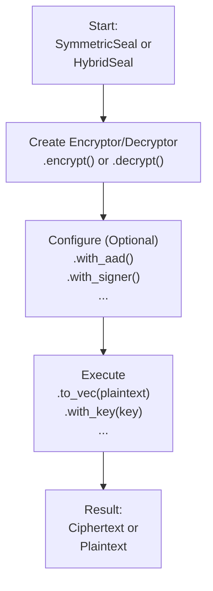

# seal-flow

[](https://crates.io/crates/seal-flow)
[](https://docs.rs/seal-flow)

A stateless, high-level cryptographic workflow library built on top of `seal-crypto`. It provides a unified, fluent, and secure interface for common cryptographic operations like hybrid and symmetric encryption.

[中文文档 (Chinese README)](./README_CN.md)

## Core Philosophy: The Fluent "Seal" API

`seal-flow` is designed to make complex cryptographic workflows feel simple and safe. The core of the library is the high-level `seal` API, which uses a **fluent builder pattern**.

All operations follow a simple, two-phase model: **Configure-then-Execute**.

1.  **Configure**: You start with a `SymmetricSeal` or `HybridSeal` factory, create an encryptor or decryptor, and chain methods like `.with_aad()` or `.with_signer()` to configure the operation.
2.  **Execute**: Once configured, you call a final method like `.to_vec()` (for in-memory data) or `.stream()` (for I/O streams) to perform the cryptographic work.

This design makes your code readable, flexible, and less prone to errors.



## Installation

Add this to your `Cargo.toml`:

```toml
[dependencies]
seal-flow = "0.1.0" # Replace with the latest version
```

## Usage: A Complete Symmetric Workflow

This example demonstrates a full encryption and decryption cycle, including metadata (AAD) and the safe key-lookup pattern.

```rust
use seal_flow::prelude::*;
use seal_crypto::prelude::SymmetricKeyGenerator;
use seal_crypto::schemes::symmetric::aes_gcm::Aes256Gcm;
use std::collections::HashMap;

fn main() -> Result<()> {
    // --- Setup ---
    // In a real app, you'd manage keys in a KMS or secure storage.
    let mut key_store = HashMap::new();
    let key = Aes256Gcm::generate_key()?;
    let key_id = "my-encryption-key-v1".to_string();
    key_store.insert(key_id.clone(), key.clone());

    let plaintext = b"Data that is being protected.";
    let aad = b"Context metadata, like a request ID or version.";

    // The high-level API factory is stateless and reusable.
    let seal = SymmetricSeal::new();

    // --- 1. Encryption ---
    // The key is wrapped for type safety.
    let key_wrapped = SymmetricKey::new(key.to_bytes());
    let ciphertext = seal
        .encrypt(key_wrapped, key_id)
        .with_aad(aad) // Bind ciphertext to context
        .to_vec::<Aes256Gcm>(plaintext)?; // Execute encryption

    println!("Encryption successful!");

    // --- 2. Decryption (Safe Key-Lookup Workflow) ---

    // a. Create a "Pending Decryptor" to inspect metadata without decrypting.
    let pending_decryptor = seal.decrypt().slice(&ciphertext)?;

    // b. Get the key ID from the header. This is a cheap and safe operation.
    let found_key_id = pending_decryptor.key_id().expect("Header must contain a key ID.");
    println!("Found key ID: '{}'. Now retrieving the key.", found_key_id);

    // c. Use the ID to fetch the correct key from your key store.
    let decryption_key_bytes = key_store.get(found_key_id).unwrap().to_bytes();
    let decryption_key_wrapped = SymmetricKey::new(decryption_key_bytes);
    
    // d. Provide the key and AAD to complete decryption.
    // `with_key` automatically infers the algorithm from the header.
    let decrypted_text = pending_decryptor
        .with_aad(aad) // Must provide the same AAD
        .with_key(decryption_key_wrapped)?;

    assert_eq!(plaintext, &decrypted_text[..]);
    println!("Successfully decrypted data!");
    Ok(())
}
```

## Usage: Hybrid Encryption Workflow

Hybrid encryption follows the same fluent pattern. You encrypt with a public key and decrypt with the corresponding private key.

```rust
use seal_flow::prelude::*;
use seal_crypto::{
    prelude::*,
    schemes::{asymmetric::traditional::rsa::Rsa2048, hash::Sha256, symmetric::aes_gcm::Aes256Gcm},
};
use std::collections::HashMap;

type Kem = Rsa2048<Sha256>; // Key Encapsulation Mechanism
type Dek = Aes256Gcm;       // Data Encapsulation Key

fn main() -> Result<()> {
    // --- Setup ---
    let (pk, sk) = Kem::generate_keypair()?;
    let mut private_key_store = HashMap::new();
    let kek_id = "rsa-key-pair-001".to_string(); // Key Encryption Key ID
    private_key_store.insert(kek_id.clone(), sk.to_bytes());

    let plaintext = b"This is a secret message for hybrid encryption.";
    let seal = HybridSeal::new();

    // --- 1. Encryption ---
    // Encrypt using the public key.
    let pk_wrapped = AsymmetricPublicKey::new(pk.to_bytes());
    let ciphertext = seal
        .encrypt::<Dek>(pk_wrapped, kek_id) // Specify the symmetric algorithm (DEK)
        .to_vec::<Kem>(plaintext)?;          // Specify the asymmetric algorithm (KEM)

    // --- 2. Decryption ---
    // Inspect header to find which private key to use.
    let pending_decryptor = seal.decrypt().slice(&ciphertext)?;
    let found_kek_id = pending_decryptor.kek_id().unwrap();

    // Fetch and wrap the private key bytes.
    let sk_bytes = private_key_store.get(found_kek_id).unwrap();
    let sk_wrapped = AsymmetricPrivateKey::new(sk_bytes.clone());

    // Provide the key to decrypt.
    let decrypted_text = pending_decryptor.with_key(sk_wrapped)?;

    assert_eq!(plaintext, &decrypted_text[..]);
    println!("Successfully performed hybrid encryption and decryption!");
    Ok(())
}
```

## Key Features & Advanced Usage

### Simplified & Secure Key Management

`seal-flow` promotes security by using strongly-typed key wrappers instead of raw bytes: `SymmetricKey`, `AsymmetricPublicKey`, `AsymmetricPrivateKey`.

For decryption, the `with_key(key_wrapper)` method is recommended. It automatically and safely infers the correct cryptographic algorithm from the ciphertext header, reducing the risk of errors.

For advanced scenarios (e.g., integrating with legacy systems), you can use `with_typed_key::<Algorithm>(concrete_key)` to explicitly specify the algorithm, overriding the header.

### Key Derivation (KDF & PBKDF)

Derive keys from a master key or a password for use cases like key rotation or password-based encryption.

```rust
use seal_flow::prelude::*;
use seal_crypto::schemes::kdf::{hkdf::HkdfSha256, pbkdf2::Pbkdf2Sha256};

fn main() -> Result<()> {
    // Derive a child key from a master key
    let master_key = SymmetricKey::new(vec![0u8; 32]);
    let deriver = HkdfSha256::default();
    let encryption_key = master_key.derive_key(
        &deriver,
        Some(b"salt"),
        Some(b"context-for-encryption"),
        32,
    )?;

    // Derive a key from a password
    let password = b"user-secure-password";
    let pbkdf2 = Pbkdf2Sha256::new(100_000); // Use a high iteration count
    let password_derived_key = SymmetricKey::derive_from_password(
        password,
        &pbkdf2,
        b"random-salt",
        32,
    )?;

    Ok(())
}
```

### Digital Signatures

In hybrid encryption, you can also sign the data to prove its origin and integrity.

```rust
use seal_flow::prelude::*;
use seal_crypto::{
    prelude::*,
    schemes::{
        asymmetric::traditional::rsa::Rsa2048,
        hash::Sha256,
        signature::ed25519::Ed25519,
        symmetric::aes_gcm::Aes256Gcm,
    },
};

type Kem = Rsa2048<Sha256>;
type Dek = Aes256Gcm;

fn main() -> Result<()> {
    let seal = HybridSeal::new();

    // 1. Generate keys for encryption (KEM) and signing.
    let (pk_kem, sk_kem) = Kem::generate_keypair()?;
    let (pk_sig, sk_sig) = Ed25519::generate_keypair()?;

    let plaintext = b"this data will be signed and encrypted";

    // 2. Encrypt and sign the data.
    let pk_kem_wrapped = AsymmetricPublicKey::new(pk_kem.to_bytes());
    let ciphertext = seal
        .encrypt::<Dek>(pk_kem_wrapped, "kem-key-id".to_string())
        .with_signer::<Ed25519>(sk_sig, "sig-key-id".to_string())
        .to_vec::<Kem>(plaintext)?;

    // 3. Decrypt and verify the signature.
    let pending_decryptor = seal.decrypt().slice(&ciphertext)?;

    let sk_kem_wrapped = AsymmetricPrivateKey::new(sk_kem.to_bytes());
    let verifier = Verifier::Ed25519(pk_sig);

    let decrypted_text = pending_decryptor
        .with_verification_key(verifier)?
        .with_key(sk_kem_wrapped)?;

    assert_eq!(plaintext, &decrypted_text[..]);
    Ok(())
}
```

### Multiple Processing Modes

While `.to_vec()` is great for in-memory data, `seal-flow` supports other modes for different needs:

-   **Streaming:** `into_writer()` for encrypting/decrypting I/O streams (`Read`/`Write`) without loading everything into memory.
-   **Parallel:** `par_to_vec()` for high-throughput in-memory processing on multi-core systems.
-   **Asynchronous:** `into_async_writer()` for non-blocking I/O in `async` applications.

Data encrypted in one mode can be decrypted in any other, thanks to a shared data format. See the `examples/` directory for detailed usage.

## Interoperability

A key feature of `seal-flow` is its perfect interoperability between processing modes. Data encrypted using any mode (e.g., `streaming`) can be decrypted by any other mode (e.g., `in_memory_parallel`), as long as the underlying algorithm (`Aes256Gcm`, etc.) and keys are the same.

This is guaranteed by a unified data format and is validated by our comprehensive `interoperability_matrix` integration test. This gives you the flexibility to choose the most efficient mode for encryption and decryption independently, based on your specific needs. For example, a memory-constrained server can stream-encrypt a large file, and a powerful client machine can decrypt it in parallel for maximum performance.

## API Layers in Detail

The library exposes three distinct API layers:

-   **High-Level API (`seal` module):** This is the recommended entry point for most users. It features a fluent builder pattern (`SymmetricSeal`, `HybridSeal`) that abstracts away all complexity. You simply chain methods to define the operation, select the mode, and execute.
-   **Mid-Level API (`flows` module):** For advanced users who need more fine-grained control. This layer allows you to directly access and use specific execution flows (e.g., `streaming`, `parallel`, `asynchronous`) without the builder abstraction.
-   **Low-Level API (`crypto` module):** Provides direct, unfiltered access to the underlying `seal-crypto` crate for cryptographic primitives. This is for experts who need to build custom logic on top of the core algorithms.

## Running Examples

You can run the provided examples using `cargo`:

```bash
# Run the high-level symmetric encryption example
cargo run --example high_level_symmetric --features=async

# Run the mid-level hybrid encryption example
cargo run --example mid_level_hybrid --features=async
```

## License

This project is licensed under the Mozilla Public License 2.0. See the [LICENSE](LICENSE) file for details. 