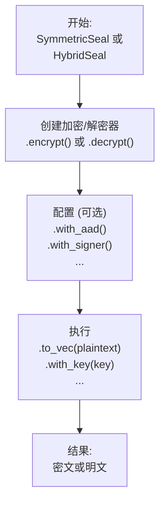

# seal-flow

[](https://crates.io/crates/seal-flow)
[](https://docs.rs/seal-flow)

`seal-flow` 是一个构建在 `seal-crypto` 之上的无状态、高级别的密码学工作流（workflow）库。它为混合加密和对称加密等常见的密码学操作提供了统一、流畅且安全的接口。

## 核心设计：流畅的 "Seal" API

`seal-flow` 旨在使复杂的密码学工作流变得简单而安全。库的核心是高层 `seal` API，它采用了**流畅的构建者模式（fluent builder pattern）**。

所有操作都遵循一个简单的两阶段模型：**配置-然后-执行（Configure-then-Execute）**。

1.  **配置（Configure）**: 你从一个 `SymmetricSeal` 或 `HybridSeal` 工厂开始，创建一个加密器或解密器，然后通过链式调用 `.with_aad()` 或 `.with_signer()` 等方法来配置操作。
2.  **执行（Execute）**: 配置完成后，你调用一个最终方法，如 `.to_vec()` (用于内存数据) 或 `.stream()` (用于I/O流)，来执行实际的密码学工作。

这种设计使你的代码可读性强、灵活，且不易出错。



## 安装

将此行添加到你的 `Cargo.toml` 中：

```toml
[dependencies]
seal-flow = "0.1.0" # 请替换为最新版本
```

## 使用方法：一个完整的对称加密工作流

本示例演示了一个完整的加密和解密周期，包括元数据（AAD）和安全的密钥查找模式。

本示例的完整代码可以在 [`examples/readme_symmetric_workflow.rs`](./examples/readme_symmetric_workflow.rs) 中找到。

## 使用方法：混合加密工作流

混合加密遵循同样流畅的模式。你使用公钥加密，并用相应的私钥解密。

本示例的完整代码可以在 [`examples/readme_hybrid_workflow.rs`](./examples/readme_hybrid_workflow.rs) 中找到。

## 主要特性与高级用法

### 简化且安全的密钥管理

`seal-flow` 通过使用强类型的密钥封装（`SymmetricKey`, `AsymmetricPublicKey`, `AsymmetricPrivateKey`）而不是原始字节来提升安全性。

对于解密，推荐使用 `with_key(key_wrapper)` 方法。它会自动且安全地从密文头部推断出正确的加密算法，减少了出错的风险。

对于高级场景（例如，与旧系统集成），你可以使用 `with_typed_key::<Algorithm>(concrete_key)` 来显式指定算法，从而覆盖头部中的信息。

### 密钥派生 (KDF & PBKDF)

从主密钥或密码派生密钥，用于密钥轮换或基于密码的加密等场景。这对于创建密钥层次结构也很有用，例如，使用密码派生主密钥，然后使用可扩展输出函数（XOF），如 SHAKE256，从中生成多个不同长度的密钥。

该示例的完整代码可以在 [`examples/readme_advanced_key_derivation.rs`](./examples/readme_advanced_key_derivation.rs) 中找到。

### 认证附加数据 (AAD)

`seal-flow` 支持认证附加数据（AAD），这是一种只被认证但不被加密的数据。这是一项关键的安全特性，用于防止重放攻击或上下文混淆攻击，即有效的密文被恶意地用于不同的上下文中。

AAD 会被混合到密码学计算中，这意味着密文与 AAD 是密码学绑定的。如果在解密期间提供的 AAD 与加密时的 AAD 不完全匹配，解密将会失败。

AAD 的常见用例包括：
-   用户 ID、会话 ID 或请求 ID。
-   版本号或文件路径。
-   任何定义加密数据上下文的元数据。

该示例的完整代码可以在 [`examples/readme_aad.rs`](./examples/readme_aad.rs) 中找到。

### 数字签名

在混合加密中，你还可以对数据进行签名，以证明其来源和完整性。

本示例的完整代码可以在 [`examples/readme_digital_signatures.rs`](./examples/readme_digital_signatures.rs) 中找到。

### 多种处理模式

虽然 `.to_vec()` 非常适合处理内存中的数据，但 `seal-flow` 还支持其他模式以满足不同需求：

-   **流式处理 (Streaming):** 使用 `into_writer()` 来加密/解密I/O流 (`Read`/`Write`)，无需将所有内容加载到内存中。
-   **并行处理 (Parallel):** 使用 `par_to_vec()` 在多核系统上进行高吞吐量的内存处理。
-   **异步处理 (Asynchronous):** 使用 `into_async_writer()` 在 `async` 应用程序中进行非阻塞I/O。

得益于统一的数据格式，用一种模式加密的数据可以用任何其他模式解密。请参阅 `examples/` 目录查看详细用法。

## 互操作性

`seal-flow`