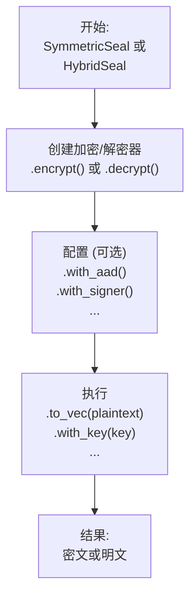

# seal-flow

[](https://crates.io/crates/seal-flow)
[](https://docs.rs/seal-flow)

`seal-flow` 是一个构建在 `seal-crypto` 之上的无状态、高级别的密码学工作流（workflow）库。它为混合加密和对称加密等常见的密码学操作提供了统一、流畅且安全的接口。

[English README](./README.md)

## 核心设计：流畅的 "Seal" API

`seal-flow` 旨在使复杂的密码学工作流变得简单而安全。库的核心是高层 `seal` API，它采用了**流畅的构建者模式（fluent builder pattern）**。

所有操作都遵循一个简单的两阶段模型：**配置-然后-执行（Configure-then-Execute）**。

1.  **配置（Configure）**: 你从一个 `SymmetricSeal` 或 `HybridSeal` 工厂开始，创建一个加密器或解密器，然后通过链式调用 `.with_aad()` 或 `.with_signer()` 等方法来配置操作。
2.  **执行（Execute）**: 配置完成后，你调用一个最终方法，如 `.to_vec()` (用于内存数据) 或 `.stream()` (用于I/O流)，来执行实际的密码学工作。

这种设计使你的代码可读性强、灵活，且不易出错。



## 安装

将此行添加到你的 `Cargo.toml` 中：

```toml
[dependencies]
seal-flow = "0.1.0" # 请替换为最新版本
```

## 使用方法：一个完整的对称加密工作流

本示例演示了一个完整的加密和解密周期，包括元数据（AAD）和安全的密钥查找模式。

本示例的完整代码可以在 [`examples/readme/symmetric_workflow.rs`](./examples/readme/symmetric_workflow.rs) 中找到。

## 使用方法：混合加密工作流

混合加密遵循同样流畅的模式。你使用公钥加密，并用相应的私钥解密。

本示例的完整代码可以在 [`examples/readme/hybrid_workflow.rs`](./examples/readme/hybrid_workflow.rs) 中找到。

## 主要特性详解

### 安全且灵活的解密工作流

本库的设计旨在防止您意外地使用错误的密钥。解密是一个两步过程，让您可以在提供密钥之前安全地检查密文的元数据。

**1. 手动密钥查找（默认模式）**

当您开始解密时，库会首先解析头部并返回一个 `PendingDecryptor`（待定解密器）。您可以检查此对象以获取用于加密的 `key_id`。这使您能从您的密钥库中获取正确的密钥。

```rust
// 1. 开始解密并获取待定状态
let pending = seal.decrypt().slice(&ciphertext)?;

// 2. 无需解密即可安全地获取密钥ID
let key_id = pending.key_id().unwrap(); // 例如 "my-key-v1"

// 3. 从您的密钥管理系统中获取正确的密钥
let key_to_use = my_key_store.get(key_id).unwrap();

// 4. 提供密钥以完成解密
let plaintext = pending.with_key(key_to_use)?;
```

**2. 自动化密钥查找 (使用 `KeyProvider`)**

为了更加方便，您可以为您的密钥库实现 `KeyProvider` trait。这允许库为您自动处理密钥查找过程。

```rust
// 你的密钥库必须实现 KeyProvider trait
struct MyKeyStore { /* ... */ }
impl KeyProvider for MyKeyStore { /* ... */ }

let key_provider = MyKeyStore::new();

// 1. 附加 provider 并调用 resolve_and_decrypt()
let plaintext = seal.decrypt()
    .with_key_provider(&key_provider)
    .slice(&ciphertext)?
    .resolve_and_decrypt()?; // 密钥查找和解密会自动发生
```

### 数字签名用于发送方身份验证

在混合加密中，发送方可以对加密元数据进行签名，以证明自己的身份并保证头部未被篡改。

当在加密期间使用 `.with_signer()` 方法时，`seal-flow` 会对密文头部创建一个数字签名并将其嵌入。在解密期间，库会自动验证此签名。如果使用了 `KeyProvider`，库会使用存储在头部的 `signer_key_id` 自动查找用于验证的公钥。

本示例的完整代码可以在 [`examples/readme/digital_signatures.rs`](./examples/readme/digital_signatures.rs) 中找到。

### 认证附加数据 (AAD)

`seal-flow` 支持认证附加数据（AAD），这是一种只被认证但不被加密的数据。这是一项关键的安全特性，用于防止重放攻击或上下文混淆攻击（即有效的密文被恶意地用于不同的上下文中）。

AAD 会被混合到密码学计算中，这意味着密文与 AAD 是密码学绑定的。如果在解密期间提供的 AAD 与加密时的 AAD 不完全匹配，解密将会失败。常见用例包括：
-   用户 ID、会话 ID 或请求 ID。
-   版本号或文件路径。
-   任何定义加密数据上下文的元数据。

该示例的完整代码可以在 [`examples/readme/aad.rs`](./examples/readme/aad.rs) 中找到。

### 高级密钥派生 (KDF & PBKDF)

本库提供对密钥派生函数的直接访问，允许您创建健壮的密钥层次结构。这对于以下场景非常有用：
-   **密钥轮换**: 从一个长期主密钥派生出子密钥。
-   **基于密码的加密**: 使用盐和高迭代次数，从低熵的用户密码安全地派生出强密码学密钥。
-   **域分离**: 从同一个主密钥为不同目的生成不同的密钥（例如，"加密密钥"、"认证密钥"）。

该示例的完整代码可以在 [`examples/readme/advanced_key_derivation.rs`](./examples/readme/advanced_key_derivation.rs) 中找到。

## 执行模式

`seal-flow` 提供四种不同的执行模式以处理任何工作负载。由于所有模式都生成统一格式的数据，您可以自由地混合和匹配它们——例如，在服务器上进行流式加密，然后在客户端上进行并行解密。

| 模式       | API 方法                                        | 用例                                                           |
| ---------- | ------------------------------------------------- | -------------------------------------------------------------- |
| **内存处理** | `.to_vec()`, `.slice()`                           | 简单、快速地处理可完全载入内存的数据。                         |
| **并行内存处理** | `.to_vec_parallel()`, `.slice_parallel()`         | 在多核系统上对较大数据进行高吞吐量处理。                       |
| **流式处理** | `.into_writer()`, `.reader()`                     | 用于处理大文件或网络I/O，避免内存占用过高。                    |
| **异步流式处理** | `.into_async_writer()`, `.async_reader()`         | 用于高并发异步应用中的非阻塞I/O（例如 Tokio）。|

## 互操作性

`seal-flow` 的一个关键特性是其在不同处理模式间的完美互操作性。使用任何模式（例如 `streaming`）加密的数据，只要底层算法（如 `Aes256Gcm`）和密钥相同，就可以被任何其他模式（例如 `in_memory_parallel`）解密。

这一点由统一的数据格式保证，并通过我们全面的 `interoperability_matrix` 集成测试进行验证。这使您可以根据具体需求，灵活地独立选择最高效的加密和解密模式。例如，内存受限的服务器可以流式加密一个大文件，而性能强大的客户端机器则可以并行解密以获得最佳性能。

## API 层级详解

该库暴露了三个不同的 API 层级：

-   **高层 API (`seal` 模块):** 这是为大多数用户推荐的入口点。它采用流畅的构建者模式 (`SymmetricSeal`, `HybridSeal`)，抽象掉了所有复杂性。您只需链式调用方法来定义操作，选择模式并执行。
-   **中层 API (`flows` 模块):** 适用于需要更精细控制的高级用户。该层允许您直接访问和使用特定的执行流（例如 `streaming`, `parallel`, `asynchronous`），而无需构建者抽象。
-   **底层 API (`crypto` 模块):** 提供对底层 `seal-crypto` crate 中加密基元直接、无过滤的访问。这适用于需要在核心算法之上构建自定义逻辑的专家。

## 运行示例

您可以使用 `cargo` 运行提供的示例：

```bash
# 运行高级别对称加密示例
cargo run --example high_level_symmetric --features=async

# 运行中级别混合加密示例
cargo run --example mid_level_hybrid --features=async
```

## 许可证

本项目采用 Mozilla Public License 2.0 授权。详情请参阅 [LICENSE](LICENSE) 文件。