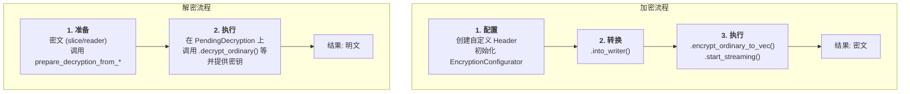

# seal-flow

[](https://crates.io/crates/seal-flow)
[](https://docs.rs/seal-flow)

`seal-flow` 是一个构建在 `seal-crypto-wrapper` 之上的高级密码学工作流（workflow）库。它为对称加密和混合加密提供了灵活、安全且高性能的接口，支持内存、流式、并行和异步等多种处理模式。

[English README](./README.md)

## 核心理念：配置-执行模式

`seal-flow` 遵循一个清晰的两阶段模型：**配置-然后-执行（Configure-then-Execute）**。这确保了密码学操作的参数在执行前被明确设定，减少了出错的可能。

-   **加密流程**:
    1.  **配置 (`EncryptionConfigurator`)**: 这是所有加密操作的起点。您需要创建一个实现了 `SealFlowHeader` trait 的自定义标头，并用它来初始化 `EncryptionConfigurator`。
    2.  **转换 (`into_*`)**: 将配置器转换为一个特定的加密流，例如 `into_writer()` 用于同步写入。
    3.  **执行 (`encrypt_*` / `start_*`)**: 在加密流上调用执行方法，如 `encrypt_ordinary()` (内存加密) 或 `start_streaming()` (流式加密)。

-   **解密流程**:
    1.  **准备 (`prepare_decryption_from_*`)**: 从一个包含密文的源（如字节切片或读取器）开始，调用 `prepare_decryption_from_*` 函数。该函数会解析出标头，并返回一个 `PendingDecryption` 实例，而不会触及加密数据。
    2.  **执行 (`decrypt_*`)**: 在 `PendingDecryption` 实例上调用相应的解密方法，并提供正确的密钥来完成解密。



## 安装

将此行添加到你的 `Cargo.toml` 中：

```toml
[dependencies]
seal-flow = "0.1.0" # 请替换为最新版本
```

## 使用方法

### 对称加密

这是最常见的用例：使用共享密钥加密和解密数据。

```rust,ignore
use seal_flow::prelude::*;
use seal_flow::common::header::{SealFlowHeader, SymmetricParams, SymmetricParamsBuilder};
use seal_flow::processor::api::{EncryptionConfigurator, prepare_decryption_from_slice};
use seal_flow::sha2::{Digest, Sha256};
use std::borrow::Cow;

// 1. 定义一个自定义标头
#[derive(Clone, bincode::Encode, bincode::Decode, serde::Serialize, serde::Deserialize)]
struct MyHeader {
    params: SymmetricParams,
    metadata: String,
}

impl SealFlowHeader for MyHeader {
    fn symmetric_params(&self) -> &SymmetricParams { &self.params }
    fn extra_data(&self) -> Option<&[u8]> { None }
}

// 2. 加密
let key = TypedSymmetricKey::generate(SymmetricAlgorithm::build().aes256_gcm())?;
let aad = b"some aad";
let params = SymmetricParamsBuilder::new(SymmetricAlgorithm::build().aes256_gcm(), 4096)
    .aad_hash(aad, Sha256::new())
    .build();
let header = MyHeader { params, metadata: "test".to_string() };

let configurator = EncryptionConfigurator::new(header, Cow::Borrowed(&key), Some(aad.to_vec()));
let ciphertext = configurator.into_writer(Vec::new())?
    .encrypt_ordinary_to_vec(b"my secret data")?;

// 3. 解密
let pending = prepare_decryption_from_slice::<MyHeader>(&ciphertext)?;
// 此处可以检查 pending.header().metadata
let plaintext = pending.decrypt_ordinary(Cow::Borrowed(&key), Some(aad.to_vec()))?;

assert_eq!(plaintext, b"my secret data");
```
该示例的完整代码可以在 [`examples/simple_symmetric.rs`](./examples/simple_symmetric.rs) 中找到。

### 混合加密 (KEM-KDF)

混合加密使用接收者的公钥来加密一个一次性的对称密钥，然后用该对称密钥加密数据。`seal-flow` 支持 KEM-KDF 模式，即从 KEM 的共享秘密中派生出对称密钥。

```rust,ignore
// (需要 "crypto-asymmetric-kem" 和 "crypto-kdf" features)
use seal_flow::crypto::traits::KemAlgorithmTrait;

// 接收方生成密钥对
let kem = KemAlgorithm::build().kyber1024().into_asymmetric_wrapper();
let key_pair = kem.generate_keypair()?;
let public_key = key_pair.public_key();

// --- 发送方 ---
// 1. KEM: 使用公钥封装共享秘密
let (shared_secret, encapsulated_key) = kem.encapsulate_key(&public_key)?;

// 2. KDF: 从共享秘密派生对称密钥
let kdf_params = KdfParams { /* ... */ };
let ephemeral_key = shared_secret.derive_key(/* ... */)?;

// 3. DEM: 使用派生的密钥加密数据
let header = HybridHeader { /* encapsulated_key, kdf_params, ... */ };
let configurator = EncryptionConfigurator::new(header, Cow::Owned(ephemeral_key), /* ... */);
let ciphertext = configurator.into_writer(Vec::new())?.encrypt_ordinary_to_vec(b"secret")?;

// --- 接收方 ---
// 1. 解析标头
let pending = prepare_decryption_from_slice::<HybridHeader>(&ciphertext)?;
let header = pending.header();

// 2. KEM: 使用私钥解封共享秘密
let shared_secret = kem.decapsulate_key(&key_pair.private_key(), &header.encapsulated_key)?;

// 3. KDF: 使用标头中的参数重新派生密钥
let symmetric_key = shared_secret.derive_key_from_params(&header.kdf_params, ...)?;

// 4. DEM: 解密数据
let plaintext = pending.decrypt_ordinary(Cow::Owned(symmetric_key), ...)?;
```
该功能的完整示例代码可以在 [`examples/hybrid_encryption.rs`](./examples/hybrid_encryption.rs) 中找到。

## 执行模式

`seal-flow` 提供多种执行模式以处理不同场景。所有模式生成的数据格式完全兼容，可自由混合搭配。

| 模式 | 加密 API | 解密 API | 用例 |
| :--- | :--- | :--- | :--- |
| **内存处理** | `encrypt_ordinary` | `decrypt_ordinary` | 简单、快速地处理可完全载入内存的数据。 |
| **并行内存处理** | `encrypt_parallel` | `decrypt_parallel` | 在多核系统上对较大数据进行高吞吐量处理。 |
| **流式处理** | `start_streaming` | `decrypt_streaming` | 用于处理大文件或网络I/O，内存占用恒定。 |
| **异步流式处理** | `start_asynchronous` | `decrypt_asynchronous` | 用于高并发异步应用中的非阻塞I/O (需 `async` feature)。 |
| **并行流式处理** | `start_parallel_streaming` | `decrypt_parallel_streaming` | 在多核系统上进行高吞吐量流式处理，兼顾性能与低内存占用。 |

## 互操作性

`seal-flow` 的一个关键特性是其在不同处理模式间的完美互操作性。使用任何模式（例如 `streaming`）加密的数据，只要底层算法和密钥相同，就可以被任何其他模式（例如 `parallel`）解密。

这一点由统一的数据格式保证，并通过我们全面的 `interoperability_matrix` 集成测试进行验证。这使您可以根据具体需求，灵活地独立选择最高效的加密和解密模式。例如，内存受限的服务器可以流式加密一个大文件，而性能强大的客户端机器则可以并行解密以获得最佳性能。

## API 层级

该库主要暴露了两个 API 层级：

-   **中层 API (`processor::api` 模块):** 这是为大多数用户推荐的入口点。它提供了对加密工作流（`EncryptionConfigurator`, `PendingDecryption`）的直接、精细的控制。
-   **底层 API (`seal-crypto-wrapper`):** 直接暴露底层的密码学原语。这适用于需要在核心算法之上构建自定义逻辑的专家。

## 运行示例

您可以使用 `cargo` 运行提供的示例。请确保根据示例的需要启用相应的 features。

```bash
# 运行简单的对称加密示例
cargo run --example simple_symmetric

# 运行流式对称加密示例
cargo run --example streaming_symmetric

# 运行混合加密示例
cargo run --example hybrid_encryption --features=crypto-asymmetric-kem,crypto-kdf
```

## 许可证

本项目采用 Mozilla Public License 2.0 授权。详情请参阅 [LICENSE](LICENSE) 文件。