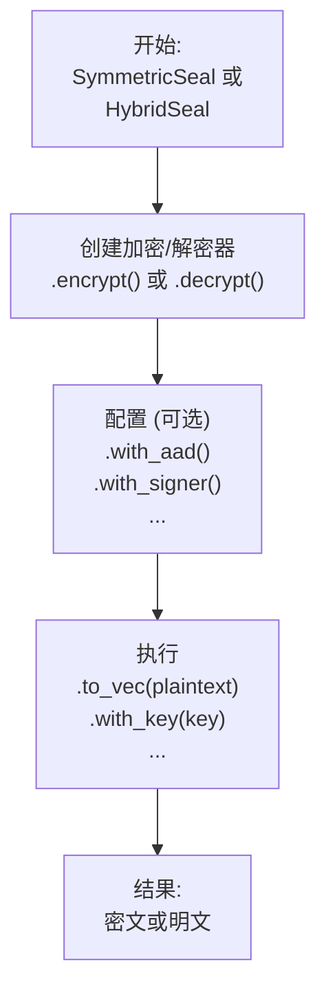

# seal-flow

[](https://crates.io/crates/seal-flow)
[](https://docs.rs/seal-flow)

`seal-flow` 是一个构建在 `seal-crypto` 之上的无状态、高级别的密码学工作流（workflow）库。它为混合加密和对称加密等常见的密码学操作提供了统一、流畅且安全的接口。

## 核心设计：流畅的 "Seal" API

`seal-flow` 旨在使复杂的密码学工作流变得简单而安全。库的核心是高层 `seal` API，它采用了**流畅的构建者模式（fluent builder pattern）**。

所有操作都遵循一个简单的两阶段模型：**配置-然后-执行（Configure-then-Execute）**。

1.  **配置（Configure）**: 你从一个 `SymmetricSeal` 或 `HybridSeal` 工厂开始，创建一个加密器或解密器，然后通过链式调用 `.with_aad()` 或 `.with_signer()` 等方法来配置操作。
2.  **执行（Execute）**: 配置完成后，你调用一个最终方法，如 `.to_vec()` (用于内存数据) 或 `.stream()` (用于I/O流)，来执行实际的密码学工作。

这种设计使你的代码可读性强、灵活，且不易出错。



## 安装

将此行添加到你的 `Cargo.toml` 中：

```toml
[dependencies]
seal-flow = "0.1.0" # 请替换为最新版本
```

## 使用方法：一个完整的对称加密工作流

本示例演示了一个完整的加密和解密周期，包括元数据（AAD）和安全的密钥查找模式。

```rust
use seal_flow::prelude::*;
use seal_crypto::prelude::SymmetricKeyGenerator;
use seal_crypto::schemes::symmetric::aes_gcm::Aes256Gcm;
use std::collections::HashMap;

fn main() -> Result<()> {
    // --- 准备工作 ---
    // 在实际应用中，你会在KMS或安全存储中管理密钥。
    let mut key_store = HashMap::new();
    let key = Aes256Gcm::generate_key()?;
    let key_id = "my-encryption-key-v1".to_string();
    key_store.insert(key_id.clone(), key.clone());

    let plaintext = b"这是需要被保护的数据。";
    let aad = b"上下文元数据，例如请求ID或版本号。";

    // 高层API工厂是无状态且可重用的。
    let seal = SymmetricSeal::new();

    // --- 1. 加密 ---
    // 密钥被封装以确保类型安全。
    let key_wrapped = SymmetricKey::new(key.to_bytes());
    let ciphertext = seal
        .encrypt(key_wrapped, key_id)
        .with_aad(aad) // 将密文与上下文绑定
        .to_vec::<Aes256Gcm>(plaintext)?; // 执行加密

    println!("加密成功！");

    // --- 2. 解密（安全的密钥查找工作流）---

    // a. 创建一个"待定解密器"以在不解密的情况下检查元数据。
    let pending_decryptor = seal.decrypt().slice(&ciphertext)?;

    // b. 从头部获取密钥ID。这是一个廉价且安全的操作。
    let found_key_id = pending_decryptor.key_id().expect("头部必须包含密钥ID。");
    println!("找到密钥ID：'{}'。现在检索密钥。", found_key_id);

    // c. 使用ID从你的密钥存储中获取正确的密钥。
    let decryption_key_bytes = key_store.get(found_key_id).unwrap().to_bytes();
    let decryption_key_wrapped = SymmetricKey::new(decryption_key_bytes);
    
    // d. 提供密钥和AAD以完成解密。
    // `with_key` 方法会自动从头部推断算法。
    let decrypted_text = pending_decryptor
        .with_aad(aad) // 必须提供相同的AAD
        .with_key(decryption_key_wrapped)?;

    assert_eq!(plaintext, &decrypted_text[..]);
    println!("成功解密数据！");
    Ok(())
}
```

## 使用方法：混合加密工作流

混合加密遵循同样流畅的模式。你使用公钥加密，并用相应的私钥解密。

```rust
use seal_flow::prelude::*;
use seal_crypto::{
    prelude::*,
    schemes::{asymmetric::traditional::rsa::Rsa2048, hash::Sha256, symmetric::aes_gcm::Aes256Gcm},
};
use std::collections::HashMap;

type Kem = Rsa2048<Sha256>; // 密钥封装机制
type Dek = Aes256Gcm;       // 数据封装密钥

fn main() -> Result<()> {
    // --- 准备工作 ---
    let (pk, sk) = Kem::generate_keypair()?;
    let mut private_key_store = HashMap::new();
    let kek_id = "rsa-key-pair-001".to_string(); // 密钥加密密钥ID
    private_key_store.insert(kek_id.clone(), sk.to_bytes());

    let plaintext = b"这是一条用于混合加密的机密消息。";
    let seal = HybridSeal::new();

    // --- 1. 加密 ---
    // 使用公钥进行加密。
    let pk_wrapped = AsymmetricPublicKey::new(pk.to_bytes());
    let ciphertext = seal
        .encrypt::<Dek>(pk_wrapped, kek_id) // 指定对称加密算法 (DEK)
        .to_vec::<Kem>(plaintext)?;          // 指定非对称加密算法 (KEM)

    // --- 2. 解密 ---
    // 检查头部以确定使用哪个私钥。
    let pending_decryptor = seal.decrypt().slice(&ciphertext)?;
    let found_kek_id = pending_decryptor.kek_id().unwrap();

    // 获取并封装私钥字节。
    let sk_bytes = private_key_store.get(found_kek_id).unwrap();
    let sk_wrapped = AsymmetricPrivateKey::new(sk_bytes.clone());

    // 提供密钥以进行解密。
    let decrypted_text = pending_decryptor.with_key(sk_wrapped)?;

    assert_eq!(plaintext, &decrypted_text[..]);
    println!("成功执行混合加密和解密！");
    Ok(())
}
```

## 主要特性与高级用法

### 简化且安全的密钥管理

`seal-flow` 通过使用强类型的密钥封装（`SymmetricKey`, `AsymmetricPublicKey`, `AsymmetricPrivateKey`）而不是原始字节来提升安全性。

对于解密，推荐使用 `with_key(key_wrapper)` 方法。它会自动且安全地从密文头部推断出正确的加密算法，减少了出错的风险。

对于高级场景（例如，与旧系统集成），你可以使用 `with_typed_key::<Algorithm>(concrete_key)` 来显式指定算法，从而覆盖头部中的信息。

### 密钥派生 (KDF & PBKDF)

从主密钥或密码中派生出新密钥，用于密钥轮换或基于密码的加密等场景。

```rust
use seal_flow::prelude::*;
use seal_crypto::schemes::kdf::{hkdf::HkdfSha256, pbkdf2::Pbkdf2Sha256};

fn main() -> Result<()> {
    // 从主密钥派生子密钥
    let master_key = SymmetricKey::new(vec![0u8; 32]);
    let deriver = HkdfSha256::default();
    let encryption_key = master_key.derive_key(
        &deriver,
        Some(b"salt"),
        Some(b"context-for-encryption"),
        32,
    )?;

    // 从密码派生密钥
    let password = b"user-secure-password";
    let pbkdf2 = Pbkdf2Sha256::new(100_000); // 使用高的迭代次数
    let password_derived_key = SymmetricKey::derive_from_password(
        password,
        &pbkdf2,
        b"random-salt",
        32,
    )?;

    Ok(())
}
```

### 数字签名

在混合加密中，你还可以对数据进行签名以证明其来源和完整性。

```rust
use seal_flow::prelude::*;
use seal_crypto::{
    prelude::*,
    schemes::{
        asymmetric::traditional::rsa::Rsa2048,
        hash::Sha256,
        signature::ed25519::Ed25519,
        symmetric::aes_gcm::Aes256Gcm,
    },
};

type Kem = Rsa2048<Sha256>;
type Dek = Aes256Gcm;

fn main() -> Result<()> {
    let seal = HybridSeal::new();

    // 1. 生成加密（KEM）和签名用的密钥。
    let (pk_kem, sk_kem) = Kem::generate_keypair()?;
    let (pk_sig, sk_sig) = Ed25519::generate_keypair()?;

    let plaintext = b"这份数据将被签名和加密";

    // 2. 加密并签名数据。
    let pk_kem_wrapped = AsymmetricPublicKey::new(pk_kem.to_bytes());
    let ciphertext = seal
        .encrypt::<Dek>(pk_kem_wrapped, "kem-key-id".to_string())
        .with_signer::<Ed25519>(sk_sig, "sig-key-id".to_string())
        .to_vec::<Kem>(plaintext)?;

    // 3. 解密并验证签名。
    let pending_decryptor = seal.decrypt().slice(&ciphertext)?;

    let sk_kem_wrapped = AsymmetricPrivateKey::new(sk_kem.to_bytes());
    let verifier = Verifier::Ed25519(pk_sig);

    let decrypted_text = pending_decryptor
        .with_verification_key(verifier)?
        .with_key(sk_kem_wrapped)?;

    assert_eq!(plaintext, &decrypted_text[..]);
    Ok(())
}
```

### 多种处理模式

虽然 `.to_vec()` 非常适合处理内存中的数据，但 `seal-flow` 还支持其他模式以满足不同需求：

-   **流式处理 (Streaming):** 使用 `into_writer()` 来加密/解密I/O流 (`Read`/`Write`)，无需将所有内容加载到内存中。
-   **并行处理 (Parallel):** 使用 `par_to_vec()` 在多核系统上进行高吞吐量的内存处理。
-   **异步处理 (Asynchronous):** 使用 `into_async_writer()` 在 `async` 应用程序中进行非阻塞I/O。

得益于统一的数据格式，用一种模式加密的数据可以用任何其他模式解密。请参阅 `examples/` 目录查看详细用法。

## 互操作性

`seal-flow` 的一个关键特性是其处理模式之间的完美互操作性。使用任何一种模式（例如 `streaming`）加密的数据，都可以被任何其他模式（例如 `in_memory_parallel`）解密，只要底层的算法（如 `Aes256Gcm`）和密钥保持一致。

这一特性由统一的数据格式保证，并由我们全面的 `interoperability_matrix` 集成测试进行验证。这使你能够根据具体需求，灵活地、独立地为加密和解密选择最高效的模式。例如，一个内存受限的服务器可以流式加密一个大文件，而一台性能强大的客户端机器则可以并行解密它以获得最佳性能。

## API分层详解

本库暴露了三个明确的API层级：

-   **高层API (`seal` 模块):** 这是推荐给绝大多数用户的入口点。它提供了一个流畅的构建者模式（`SymmetricSeal`, `HybridSeal`），抽象了所有实现的复杂性。你只需简单地链式调用方法来定义操作、选择模式并执行。
-   **中层API (`flows` 模块):** 专为需要更细粒度控制的高级用户设计。该层允许你直接访问和使用特定的执行流（例如 `streaming`, `parallel`, `asynchronous`），而无需通过构建者模式的抽象。
-   **底层API (`crypto` 模块):** 提供对底层 `seal-crypto` crate 中密码学原语的直接、无过滤的访问。这适用于需要在核心算法之上构建自定义逻辑的专家。

## 运行示例

你可以使用 `cargo` 来运行我们提供的示例：

```bash
# 运行高层对称加密示例
cargo run --example high_level_symmetric --features=async

# 运行中层混合加密示例
cargo run --example mid_level_hybrid --features=async
```

## 许可证 (License)

本项目采用 Mozilla Public License 2.0 许可证。详情请参阅 [LICENSE](LICENSE) 文件。 